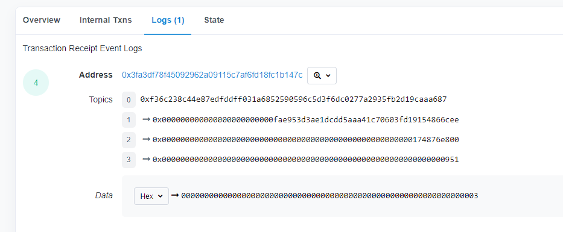

## 事件

solidity中的事件（`event`）是EVM上的日志的抽象，它具有两个特点：

- 响应：应用程序（`ether.js`）可以通过RPC接口订阅和监听这些事件，并在前端做出相应。
- 经济：事件是EVM上比较经济的存储数据的方式，每个大概消耗2000 `gas`；相比之下，链上存储一个新的变量至少需要20000 `gas`。

#### 规则

事件的声明由 `event`关键字开头，然后 跟事件名称，括号里面写好事件需要记录的变量类型和变量名。以 `ERC20`代币合约的 `Transfer`事件为例：

```
event Transfer(address indexed from, address indexed to, uint256 value);
```

我们可以看到，`Transfer`事件共记录了3个变量 `from`，`to`，`value`，分别对应代笔的转账地址，接受地址和转账数量。

同事 `from`和 `to`掐你满带着 `indexed`关键字，每个 `indexed`标记的变量可以理解为检索时间的索引键，再以太坊上单独作为一个 `topic`进行储存和索引，程序可以轻松的筛选出特定的转账地址和接收地址的转账事件。每个事件最多代有3个带 `indexed`的变量。每个 `indexed`变量的大小为固定的256bit。事件的哈希遗迹这三个带 `indexed`的变量再EVM日志中通常被储存为 `topic`。其中 `topic[0]`是此事件的 `keccak256`哈希，`topic[1]`到 `topic[3]`存储了带 `indexed`变量的 `keccak256`哈希。


