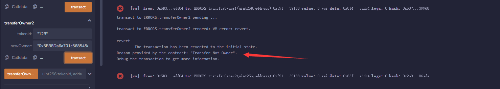

## 异常

写智能合约经常会出 `bug`，solidity中的异常命令帮助我们 `debug`。

#### Error

`error`是 `solidity 0.8`新加的内容，方便高效（省 `gas`）地向用户解释操作失败地原因。人们可以在 `contract`之外定义异常。下面，我们定义一个 `TransferNotOwner`异常，当用户不是代币 `owner`地时候尝试转账，会抛出错误：

```
error TransferNotOwner(); // 自定义error
```

在执行中，`error`必须搭配 `revert`（回退）命令使用。

```
	function transferOwner1(uint256 tokenId, address newOwner) public {
		if(_owners[tokenId] != msg.sender){
			revert TransferNotOwner();
		}
		_owners[tokenId] = newOwner;
	}
```

我们定义了一个 `transferOwner1()`函数，它会检查代币地 `owner`是不是发起人，如果不是，就会抛出 `TransferNotOwner`异常；如果是的话，就会转账。

#### Require

`require`命令是 `solidity 0.8`之前抛出异常的常用方法，目前很多主流合约仍然还在使用它。它很好用，唯一的缺点就是 `gas`随着描述异常的字符串长度增加，币 `error`命令要高。使用方法：`require(检查条件， “异常的描述)`，当检查条件不成立的时候，就会抛出异常。

我们用 `require`命令重写一下上面的 `transferOwner`函数：

```
	function transferOwner2(uint256 tokenId, address newOwner) public{
		require(_owners[tokenId] == msg.sender, "Transfer Not Owner");
		_owners[tokenId] = newOwner;
	}
```

#### Assert

`assert`命令一般用于程序员写程序的 `debug`，因为它不能抛出异常的原因 （比 `require`少个字符串）。它的用法很简单，`assert(检查条件)`，当检查条件不成立的时候，就会抛出异常。

我们用 `assert`命令重写一下上面的 `transferOwner`函数：

```
	function transferOwner3(uint256 tokenId, address newOwner) public {
		assert(_owners[tokenId] == msg.sender);
		_owners[tokenId] = newOwner;
	}
```

#### 在Remix上验证

1. 输入任意 `uint256`数字和非0地址，调用 `transferOwner1`，也就是 `error`方法，控制台抛出了异常并显示我们自定义的 `TransferNotOwner`。


2. 输入任意 `uint256`数字和非0地址，调用 `transferOwner2`，也就是 `require`方法，控制台抛出了异常并打印出 `require`中的字符串。



3. 输入任意 `uint256`数字和非0地址，调用 `transferOwner3`，也就是 `assert`方法，控制台只抛出了异常。


#### 三种方法的gas比较

我们比较一下三种抛出异常的 `gas`消耗，通过remix控制台的Debug按钮们，你能查到每次函数调用的 `gas`消耗分别如下：

1. `error`方法 `gas`消耗：24457
2. `require`方法 `gas`消耗：24755
3. `assert`方法 `gas`消耗：24473

我们可以看到，`error`方法 `gas`最少，其次是 `assert`，`require`方法消耗 `gas`最多！因此，`error`即可以告知用户抛出异常的原因，又能省 `gas`。
