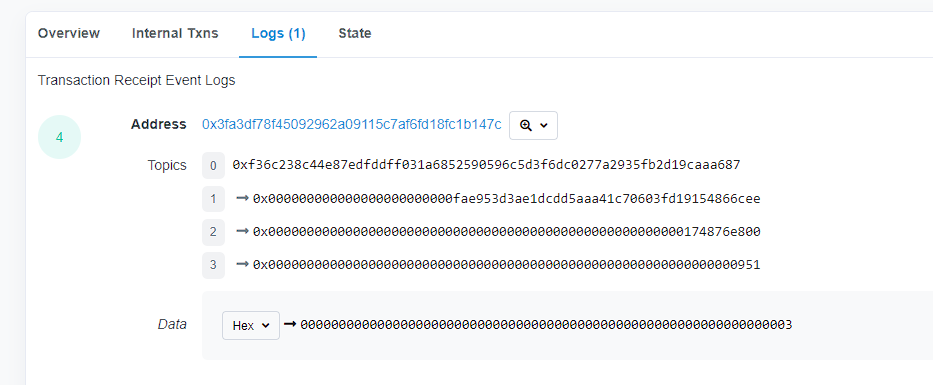
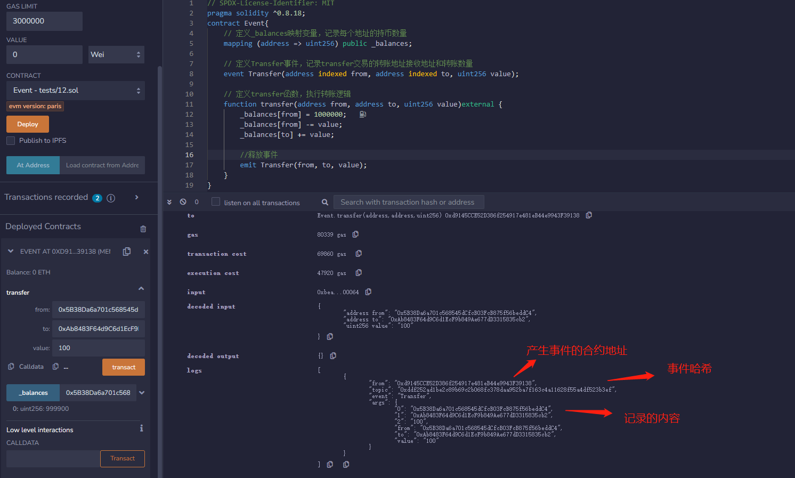

## 事件

solidity中的事件（`event`）是EVM上的日志的抽象，它具有两个特点：

- 响应：应用程序（`ether.js`）可以通过RPC接口订阅和监听这些事件，并在前端做出相应。
- 经济：事件是EVM上比较经济的存储数据的方式，每个大概消耗2000 `gas`；相比之下，链上存储一个新的变量至少需要20000 `gas`。

#### 规则

事件的声明由 `event`关键字开头，然后 跟事件名称，括号里面写好事件需要记录的变量类型和变量名。以 `ERC20`代币合约的 `Transfer`事件为例：

```
event Transfer(address indexed from, address indexed to, uint256 value);
```

我们可以看到，`Transfer`事件共记录了3个变量 `from`，`to`，`value`，分别对应代笔的转账地址，接受地址和转账数量。

同时 `from`和 `to`前面带着 `indexed`关键字，每个 `indexed`标记的变量可以理解为检索时间的索引键，再以太坊上单独作为一个 `topic`进行储存和索引，程序可以轻松的筛选出特定的转账地址和接收地址的转账事件。每个事件最多代有3个带 `indexed`的变量。每个 `indexed`变量的大小为固定的256bit。事件的哈希遗迹这三个带 `indexed`的变量再EVM日志中通常被储存为 `topic`。其中 `topic[0]`是此事件的 `keccak256`哈希，`topic[1]`到 `topic[3]`存储了带 `indexed`变量的 `keccak256`哈希。



`value`不带 `indexed`关键字，会储存在时间的 `data`部分中，可以理解为事件的“值”。`data`部分的变量不能被直接检索，但可以储存任意大小的数据。因此一般 `data`部分可以用来储存复杂的数据结构，例如数组和字符串等等，因为这些数据超过了256比特，即使存储在事件的 `topic`部分中，也是以哈希的方式存储。另外，`data`部分的变量在存储上消耗的gas相比于 `topic`更少。

我们可以在函数里释放事件。在下面的例子中，每次用 `_transfer()`函数进行转账操作的时候，都会释放 `Transfer`事件，并记录相应的变量。

```
//定义_transfer函数，执行转账逻辑
function _transfer(
	address from,
	address to,
	uint amount
) external {
	_balances[from] = 10000000; // 给抓张得治一些初始代币
	_balances[from] -= amount; // from得治减去转账数量
	_balances[to] += amount; // to地址加上转账数量

	//释放事件
	emit Transfer(from, to, amount);
}
```

#### Remix演示

以 `Event.sol`合约为例，编译部署。

然后调用 `_transfer`函数。



可以在etherscan等网站上查询相应的事件明细
