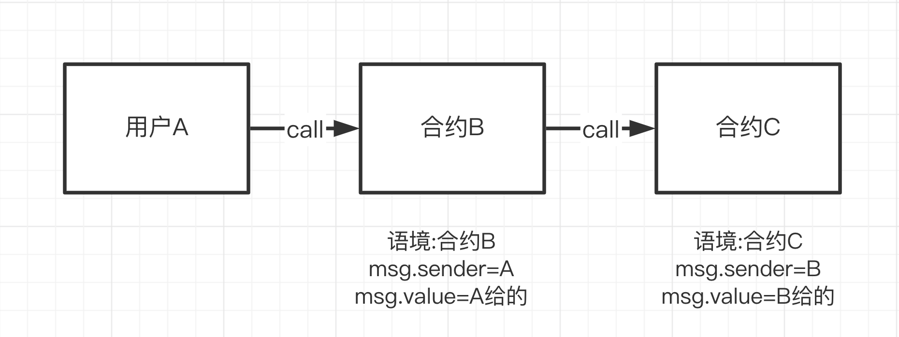

## Delegatecall

`delegatecall`与 `call`类似，是solidity中地址类型的低级成员函数。`delegate`是委托/代表的意思，那么 `delegeatecall`委托了什么？

当用户 `A`通过合约 `B`来 `call`合约 `C`的时候，执行的是合约 `C`的函数，语境（`context`，可以理解为包含变量和状态的环境）也是合约 `C`的：`msg.sender`是 `B`的地址，并且如果函数改变一些状态变量，产生的效果会作用于合约 `C`的变量上。

